#### Japan Container Days 2018 HandsOn 
# Kubernetesで画像認識の推論アプリを動かしてみよう

機械学習を既存のアプリケーションに組み込む事例が増えています。この推論環境として、コンテナを利用することで、機械学習アプリも通常のアプリケーションと同様に高い可搬性や拡張性をもたせることができます。

また、マイクロサービス型のアプリにして、Kubernetesでオーケストレーションすることで、Webアプリエンジニアと機械学習エンジニアがそれぞれ開発したアプリケーションに対して柔軟にバージョン管理できます。

そこで、今回のハンズオンでは、簡単な画像認識を行うアプリを作り、Kubernetesで動かしてみましょう。

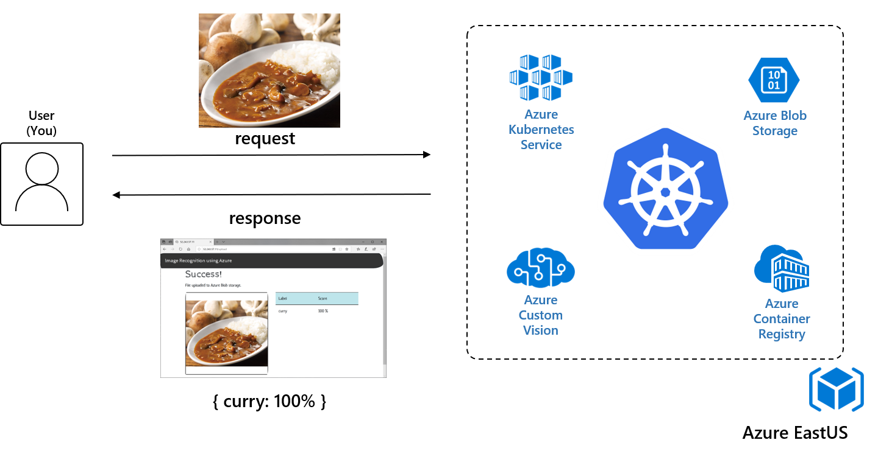

ここでは、以下のことを行います。

1. Kubernetesクラスタの作成
1. 画像の学習＆モデル作成
1. Webアプリの開発
1. コンテナレジストリの作成
1. コンテナイメージのビルド
1. Webアプリが使用するストレージの作成
1. Kubernetesクラスタへのデプロイ
1. 画像認識アプリの動作確認
1. ローリングアップデート
1. スケールアップ

---
今回のハンズオンで作成する環境のアーキテクチャは以下の通りです。

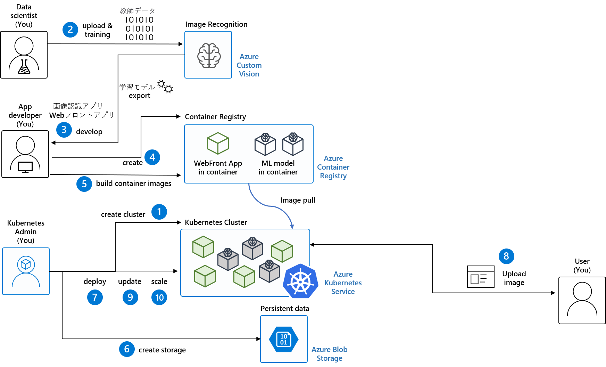


# 前提環境
* Azureアカウント（登録にはクレジットカードが必要です）
* Microsoftアカウント

# 0.準備

## A. Azure Cloud Shellへのアクセス

Azure Cloud ShellはWebブラウザでAzureのリソースを操作できるツールです。

以下のサイトにアクセスし、Azureにログインします。

https://portal.azure.com/

Cloud Shellを起動するときは、ポータル上部の［>_］をクリックしてください。

Cloud Shellでファイルを永続化するにはAzure Filesを使用します。そのため、初回起動時に、リソース グループ、ストレージ アカウント、Azure Files共有を作成するダイアログが表示されます。
ここでは、Bash（Linux）を選びます。

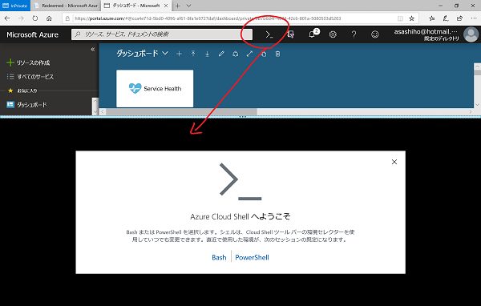


次に、有効なAzureサブスクリプションを選択して "ストレージの作成"をクリックしてください。

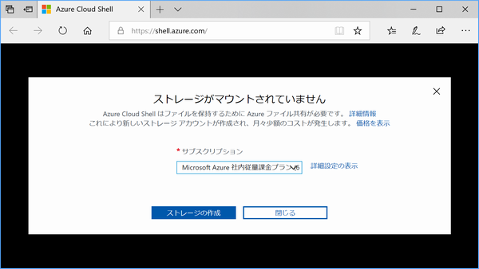

しばらくすると、Cloud Shellが起動します。ここで任意のコマンドを実行できますので、まずAzureのリソースを利用するために、次の4つのコマンドを実行します。

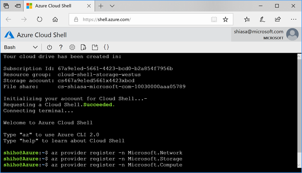

```bash
$ az provider register -n Microsoft.Network
$ az provider register -n Microsoft.Storage
$ az provider register -n Microsoft.Compute
$ az provider register -n Microsoft.ContainerService
```

本ハンズオンで利用するAzure Cloud Shellは、以下のツールがあらかじめインストールされています。

| Category            | Name                                                                            |
|---------------------|---------------------------------------------------------------------------------|
| Linux ツール        | Bash/zsh/sh/tmux/dig                                                                |
| Azure ツール        | Azure CLI  |
| テキスト エディター | vim/nano/emacs/code                                                                |
| ソース管理          | git                                                                             |
| ビルド ツール       | make/maven/npm/pip                                                                 |
| Containers          | Docker CLI/Docker Machine/kubectl/Helm/DC/OS CLI                                   |
| データベース        | MySQL クライアント/PostgreSql クライアント/sqlcmd ユーティリティ/mssql-scripter    |
| その他              | iPython クライアント/Cloud Foundry CLI/Terraform/Ansible/Chef InSpec                |
|                     |                                                                         

また、ブラウザ上でGUIエディタを使用することもできます。
Cloud Shellのバーにある｛｝ボタンをクリックすると、エディタが起動し、マニフェストファイルなどをGUIで修正できます。

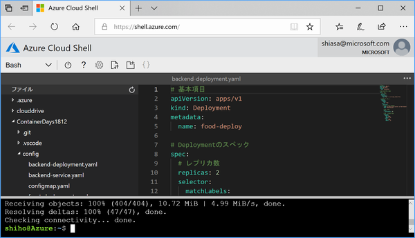

※Cloud Shellでは、コピー[Ctrl+C] ペースト[Shift+Ins]です。

> [Azure Cloud Shell 公式サイト](https://docs.microsoft.com/ja-jp/azure/cloud-shell/overview)


## B. リソースグループ作成
Azureでは、一つのアプリケーションを構成するためのサービス、Webサーバー、データベース、ストレージ、ネットワークなど、相互依存している複数のリソースを「リソースグループ」でまとめて管理することができます。

次のコマンドを実行して、今回のハンズオンで使うAzureのリソースグループを作成します。

```
$ RES_GROUP=AKS-HandsOn
$ LOCATION=eastus

$ az group create -g $RES_GROUP -l $LOCATION
```
ここでは、「AKS-HandsOn」という名前のリソースグループを、Azureのeastusに作成しました。このリソースグループに、コンテナレジストリやKubernetesクラスタ、Webアプリの永続データを保存するためのクラウドストレージを作成していきます。

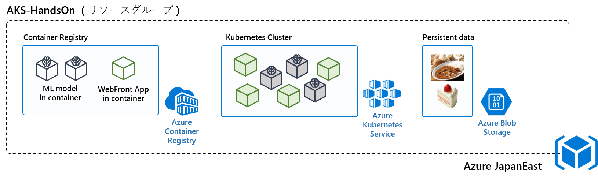

これで準備が整いましたので、環境をつくっていきましよう。


# 1. Kubernetesクラスタの作成
ハンズオンで利用するKubernetesクラスタを作成します。

クラスタの作成には15分ほどかかります。なお、作成中は``` - Running ..```が表示されます。

```bash
$ AKS_CLUSTER=akscluster

$ az aks create \
    -n $AKS_CLUSTER \
    -g $RES_GROUP \
    --node-vm-size Standard_DS2_v2 \
    --node-count 2 \
    --generate-ssh-keys
```

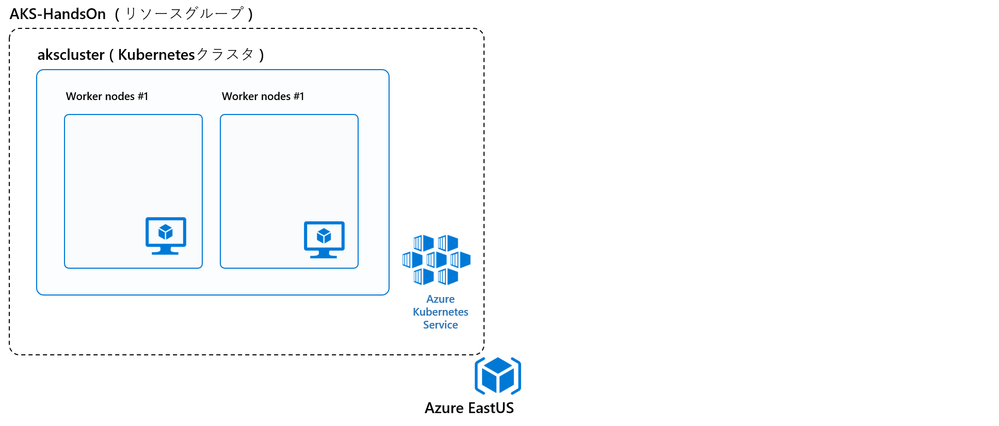

ここでは、node-countオプションで指定した、2台のWorkerノード(Standard_DS2_v2)からなるクラスタを作成しました。

なお、Workerノード1台当たりのスペックは以下の通りです。

|サイズ|	vCPU|	メモリ: GiB|	一時ストレージ (SSD) GiB	|最大データ ディスク数|	
|---|---|---|---|---|
|Standard_DS2_v2|	2|	7|	14|	8|


>[Azure Kubernetes Service 公式サイト](https://docs.microsoft.com/ja-jp/azure/aks/)


# 2. 画像の学習＆モデル作成
Kubernetesクラスタを作成している間に、画像認識のためのアプリケーションを作成します。

今回のハンズオンでは、ブラウザからオリジナル画像のアップロードを行うだけで、画像認識をおこなうTensorFlowの学習済みモデル(pb)とDockerfileなどを自動生成できる「**Azure Custom Vision**」を使います。


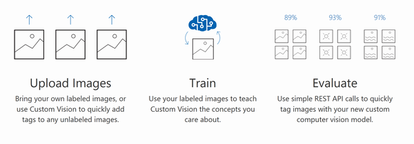

今回のハンズオンでは時間の都合でデモのみになりますが、詳細な手順は[こちら](CustomVision.md)にあります。少ないデータセットでも画像認識のモデルが作成できますので、ご興味ある方は、自宅などでぜひお試しください。


>[Azure Custom Vision 公式サイト](https://azure.microsoft.com/ja-jp/services/cognitive-services/custom-vision-service/)

# 3. Webアプリの開発
次に、Kubernetesクラスタで動かすサンプルアプリをGithubからクローンします。

```bash
$ git clone https://github.com/asashiho/ContainerDays1812
$ cd ContainerDays1812/
```


今回のサンプルアプリケーションは以下の構成になっています。
クライアントからのリクエストを受け付ける「Webフロント」はNode.jsで書かれ、リクエストされた画像を画像認識アプリに問い合わせ、結果をクライアントに返します。


画像認識アプリは、ランチメニューを推論するもの(v1.0)と、デザートメニューを推論するもの(v2.0)をKubernetesクラスタで動かします。

あらかじめ、手順2で作成したものでTensorFlowのモデルが含まれるPythonのWeb APIになっています。

また、Webアプリで使用する画像は、コンテナ内では保持せず、Azureのストレージサービスである「**Azure Blob Storage**」を使います。


# 4. コンテナレジストリの作成
Webアプリの用意ができましたので、Kubernetesクラスタで動かすコンテナイメージを格納するためのプライベートレジストリを作成します。

## 4.1 レジストリ名の名前チェック
レジストリはAzure Container Registory レジストリ名は任意の名前でかまいませんが、一意でなければいけません。
次のコマンドで、重複がないかをチェックできます。

```bash
$ ACR_NAME=acrregistry$RANDOM
$ echo $ACR_NAME

$ az acr check-name -n $ACR_NAME
```


## 4.2 コンテナレジストリの作成
重複がないことを確認出来たら、次のコマンドでコンテナレジストリを作成します。

```bash
$ az acr create -g $RES_GROUP -n $ACR_NAME \
                --sku Standard \
                -l $LOCATION
```
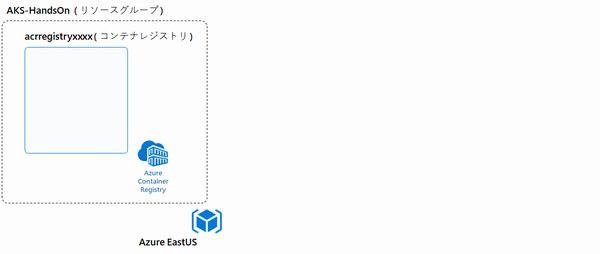


## 4.3 クラスタからレジストリを利用するための設定
Kubernetesクラスタからコンテナレジストリを利用するための権限を付与します。

```bash
$ CLIENT_ID=$(az aks show -g $RES_GROUP -n $AKS_CLUSTER --query "servicePrincipalProfile.clientId" -o tsv)

$ ACR_ID=$(az acr show -n $ACR_NAME -g $RES_GROUP --query "id" -o tsv)

$ az role assignment create --assignee $CLIENT_ID --role Reader --scope $ACR_ID

```
これで作成したコンテナレジストリ上のイメージをKubernetesクラスタにPullできるようになりました。

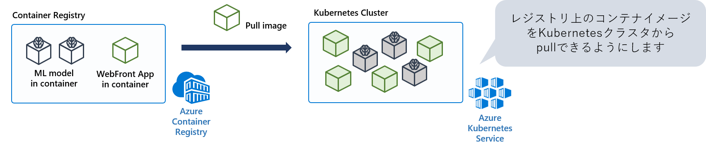


>[Azure Container Registry 公式サイト](https://docs.microsoft.com/ja-jp/azure/container-registry/)


# 5. コンテナイメージのビルド

作成したWebアプリのDockerイメージ作成します。Azure Container RegistryのACR Taskを使いビルドします。これは、開発環境のDockerfileをもとに、必要なソースコードをAzure Container Registryにアップロードしてコンテナイメージをビルドできます。

今回のハンズオンでは、Webフロントアプリおよびバージョンの異なる2つの画像認識アプリを使用しますので、次のコマンドでそれぞれビルドします。

```bash
$ az acr build --registry $ACR_NAME --image web-front:v1.0 web_front/

$ az acr build --registry $ACR_NAME --image food-recognition:v1.0 lunch_recognition/

$ az acr build --registry $ACR_NAME --image food-recognition:v2.0 dessert_recognition/
```

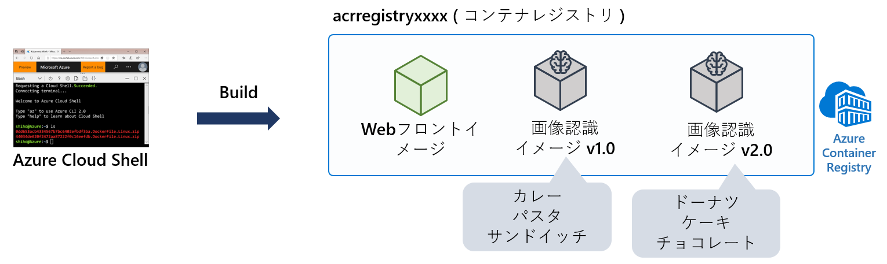


# 6. Webアプリが利用するストレージの作成
今回のハンズオンでは、Webアプリで使う画像データを、コンテナ内ではなくクラウドのストレージサービスで管理します。

次のコマンドを実行して、Azure Blob Storageのアカウントを作成します。アカウント名は任意で構いませんが、一意である必要があります。

```bash
$ BLOB_ACCOUNT=blobstorage$RANDOM
```
次のスクリプトを実行して、ストレージアカウントとストレージを作成します。

```bash
$ ./create-storage.sh $BLOB_ACCOUNT $LOCATION $RES_GROUP
```

これでアプリの永続データを管理するための、クラウドストレージの用意ができました。Webアプリからこのストレージを使用するときに必要な接続情報は、KubernetesのConfigMapで管理します。
(詳細:7.4 ConfigMapのマニフェストファイル作成)

>[Azure Blob Storage 公式サイト](https://azure.microsoft.com/ja-jp/services/storage/blobs/)


# 7. Kubernetesクラスタへのデプロイ
これで、クラスタの構築、Webアプリのコンテナイメージの作成、永続データを管理するストレージの用意ができましたので、いよいよKubernetesクラスタにWebアプリをデプロイします。


## 7.1 クラスタへの接続情報の取得
まず、Kubernetesクラスタに接続するために、Cloud Shellで以下のコマンドを実行します。

コマンドを実行すると、.kubeディレクトリに必要な接続情報が書き込まれます。

```bash
$ az aks get-credentials -g $RES_GROUP -n $AKS_CLUSTER
```
## 7.2 クラスタの確認

次のコマンドで、クラスタのNodeが動作しているかを確認します。

今回は、2台のWorkerノードを起動しているので、次のように[STATUS]が「Ready」になっているのを確認しましょう。

```bash
$ kubectl get node

NAME                       STATUS   ROLES   AGE   VERSION
aks-nodepool1-58736413-0   Ready    agent   56m   v1.9.11
aks-nodepool1-58736413-1   Ready    agent   56m   v1.9.11
```
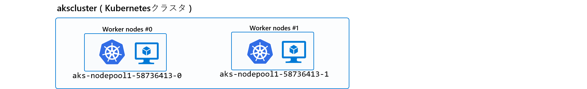

Workerノードの詳細を確認するには、次のコマンドを実行します。
```bash
$ kubectl describe node                                          

Name:               aks-nodepool1-58736413-0
Roles:              agent
Labels:             agentpool=nodepool1
                    beta.kubernetes.io/arch=amd64
～～
Conditions:
  Type                 Status  LastHeartbeatTime                 
～～
Addresses:
  InternalIP:  10.240.0.4
  Hostname:    aks-nodepool1-58736413-0
Capacity:
 cpu:     2
 memory:  7137152Ki
 pods:    110
Allocatable:
 cpu:     1940m
 memory:  5567360Ki
 pods:    110
```

## 7.3 Deploymentのマニフェストファイル作成

**※ 今回のハンズオンで使用するKubernetesのマニフェストファイルのサンプルは``ContainerDays1812/config/``
にあります。**


まず、WebアプリのDeploymentで指定する、コンテナイメージのURL確認するため、次のコマンドを実行します。

```bash
$ az acr list -g $RES_GROUP --query "[].{acrLoginServer:loginServer}" -o tsv

acrregistryxxxx.azurecr.io
```
ここで、WebフロントアプリのDeploymentのコンテナイメージ格納場所を修正します。次のマニフェストファイルは、コンテナイメージが「acrregistryxxxx.azurecr.io」に格納されている場合の例です。

ここを皆さんの環境にあわせて、書き換えてください。


```ContainerDays1812/config/front-deployment.yaml
apiVersion: apps/v1
kind: Deployment
metadata:
  name: front-deploy

spec:
      containers:
      # コンテナイメージの場所
      - image: acrregistryxxxx.azurecr.io/web-front:v1.0       #<=ここを修正
        name: front-container
```

同様にしてバックエンドアプリのDeploymentのコンテナイメージ格納場所を修正します。

```ContainerDays1812/config/backend-deployment.yaml
apiVersion: apps/v1
kind: Deployment
metadata:
  name: food-deploy

spec:
      containers:
      # コンテナイメージの場所
      - image: acrregistryxxxx.azurecr.io/food-recognition:v1.0 #<=ここを修正
        name: food-container
```

これで、作成したプライベートレジストリからクラスタにコンテナイメージを取得できるようになりました。

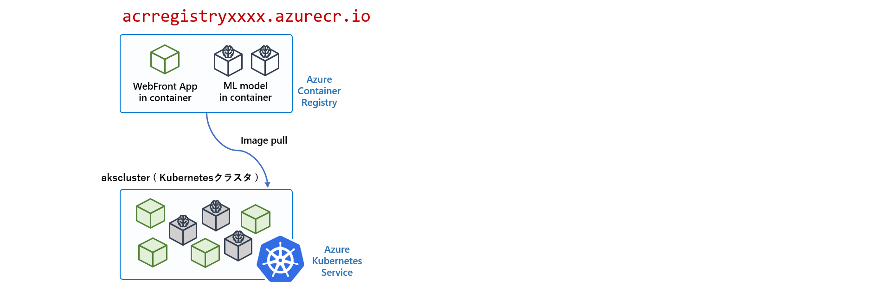


## 7.4 ConfigMapのマニフェストファイル作成
Webアプリで利用するストレージに接続するための情報を取得するためのKubernetesのConfigMapリソースを作成します。

まず、次のコマンドを実行して、ストレージの接続文字列を確認します。

```bash
$ az storage account show-connection-string \
    -n $BLOB_ACCOUNT \
    -g $RES_GROUP \
    -o tsv 

DefaultEndpointsProtocol=https;EndpointSuffix=core.windows.net;AccountName=blobstoragexxxx;AccountKey=xxxx
```

この接続文字列を、ConfigMapのマニフェストファイルに設定してください。次の例ではkeystringに「DefaultEndpoints～」を設定しています。

ここを皆さんの環境にあわせて、書き換えてください。

```ContainerDays1812/config/configmap.yaml
apiVersion: v1
kind: ConfigMap
data:
    keystring: "DefaultEndpointsProtocol=https;EndpointSuffix=core.windows.net;AccountName=blobstoragexxxx;AccountKey=xxxx"
```


## 7.5 ConfigMapの作成

次のコマンドを実行して、クラスタ内にConfigMapを作成します。

```bash
$ kubectl apply -f config/configmap.yaml
```

ConfigMapができているかどうかを確認します。

```bash
$ kubectl get configmap
NAME             DATA      AGE
project-config   1         35s


$ kubectl describe configmap
Name:         project-config
Data
====
keystring:
----
DefaultEndpointsProtocol=https;EndpointSuffix=core.windows.net;AccountName=blobstoragexxxx;AccountKey=xxxxx
```
※ 今回はハンズオンのためConfigMapを使用していますが、Keyなどの秘匿情報は「Sercret」を使ってください。

## 7.6 バックエンドの画像認識アプリをデプロイ

まず、バックエンドとなる画像認識アプリをデプロイします。
```bash
$ kubectl apply -f config/backend-deployment.yaml
```
このマニフェストファイルで2つの画像認識アプリPodが起動します。また、Podのリソース要求とリソース制限を指定しています。

```config/backend-deployment.yaml
# 基本項目
apiVersion: apps/v1
kind: Deployment
metadata:
  name: food-deploy

# Deploymentのスペック
spec:
  # レプリカ数
  replicas: 2
  selector:
    matchLabels:
      app: food   # テンプレートの検索条件

  # Podのテンプレート
  template:
    metadata:
      labels:
        app: food
～中略～
        # リソース要求と制限
        resources: 
          requests:
            cpu: 400m
            memory: 1Gi
          limits:
            cpu: 400m
            memory: 1Gi
```

次のコマンドを実行し、Podの状態を確認します。

```bash
$ kubectl get pod
NAME                           READY   STATUS    RESTARTS   AGE
food-deploy-5ff5cc749d-7q9tw   1/1     Running   0          96s
food-deploy-5ff5cc749d-wfq6x   1/1     Running   0          96s
```

マニフェストファイルに指定した通り、2つのPodが起動します。


## 7.7 Webフロントアプリのデプロイ
つづいて、Webフロントアプリをデプロイします。

```bash
$ kubectl apply -f config/front-deployment.yaml
```

Deploymentのポイントとなる部分のみを説明します。
この「front-deploy」は、Webフロントアプリを3つ動かすためのものです。
Podには「app: front」というラベルを付けて、サービスから呼び出せるようにしています。

クラウドストレージに接続するための文字列は環境変数「AZURE_STORAGE_CONNECTION_STRING」としてConfigMapから取得しています。


```bash
# 基本項目
apiVersion: apps/v1
kind: Deployment
metadata:
  name: front-deploy

# Deploymentのスペック
spec:
  # レプリカ数
  replicas: 3
  selector:
    matchLabels:
      app: front   # テンプレートの検索条件

  # Podのテンプレート
  template:
    metadata:
      labels:
        app: front
    spec:
      containers:
      # コンテナイメージの場所
      - image: acrregistryxxxx.azurecr.io/web-front:v1.0   
        name: front-container
        imagePullPolicy: Always
        
        # ポート番号
        ports:
        - containerPort: 3000

        # 環境変数の設定
        env:
          - name: NODE_ENV
            value: production

          # Azure Blob Storageの接続文字列
          - name: AZURE_STORAGE_CONNECTION_STRING
            valueFrom:
              configMapKeyRef:
                name: project-config
                key: keystring
```


Podの状態を確認します。3つのWebフロントアプリのPod(front-deploy-xxx)と、2つの画像認識アプリのPod(food-deploy-xxx)が起動しているのが分かります。

```bash
$ kubectl get pod
NAME                           READY   STATUS    RESTARTS   AGE
food-deploy-5ff5cc749d-7q9tw   1/1     Running   0          96s
food-deploy-5ff5cc749d-wfq6x   1/1     Running   0          96s
front-deploy-56454d478-cv6kv   1/1     Running   0          96s
front-deploy-56454d478-kf9fj   1/1     Running   0          96s
front-deploy-56454d478-rp7s6   1/1     Running   0          96s
```


KubernetesのDeploymentリソースを作成すると、ReplicaSetとPodも生成されます。次のコマンドを実行してリソースを確認してみましょう。

```bash
$ kubectl get po,rs,deploy
NAME                               READY   STATUS    RESTARTS   AGE
pod/food-deploy-f9df7cc47-hxh4k    1/1     Running   0          67s
pod/food-deploy-f9df7cc47-ktxfl    1/1     Running   0          64s
pod/front-deploy-56454d478-cv6kv   1/1     Running   0          12m
pod/front-deploy-56454d478-kf9fj   1/1     Running   0          12m
pod/front-deploy-56454d478-rp7s6   1/1     Running   0          12m

NAME                                           DESIRED   CURRENT   READY   AGE
replicaset.extensions/food-deploy-5ff5cc749d   0         0         0       12m
replicaset.extensions/food-deploy-f9df7cc47    2         2         2       67s
replicaset.extensions/front-deploy-56454d478   3         3         3       12m

NAME                                 DESIRED   CURRENT   UP-TO-DATE   AVAILABLE   AGE
deployment.extensions/food-deploy    2         2         2            2           12m
deployment.extensions/front-deploy   3         3         3            3           12m
```

これで、クラスタ内にアプリが動いてる状態になりました。

## 7.8 サービスの作成

クラスタ内外からのアクセスを可能にするため、Webフロントアプリと画像認識アプリのそれぞれのサービスを作成します。

```bash
$ kubectl apply -f config/backend-service.yaml
$ kubectl apply -f config/front-service.yaml
```

```
# 基本項目
apiVersion: v1
kind: Service
metadata:
  name: food-recognition

# Serviceのスペック
spec:
  #type: LoadBalancer
  ports:   # ポート番号
    - port: 80
      targetPort: 80
      protocol: TCP
  
  # C. Podの条件(ラベル)
  selector:
    app: food
```
数分すると、サービスにアドレスが割り当てられます。サービス「web-front」に割り当てられた<EXTERNAL-IP>が、クラスタ外部からアクセスする際のアドレスになるので確認します。

```bash
$ kubectl get svc

NAME               TYPE           CLUSTER-IP     EXTERNAL-IP    PORT(S)        AGE
food-recognition   ClusterIP      10.0.160.179   <none>         80/TCP         7m30s
kubernetes         ClusterIP      10.0.0.1       <none>         443/TCP        104m
web-front          LoadBalancer   10.0.253.85    40.117.82.215   80:31755/TCP   7m30s                                         
```

# 8. 画像認識アプリの動作確認
ブラウザを起動して

``` http://<web-frontのEXTERNAL-IP>/ ```

にアクセスします。

サンプルアプリの[Choose file]をクリックして、

* カレー
* パスタ
* サンドイッチ

のいずれかの画像をアップロードします。

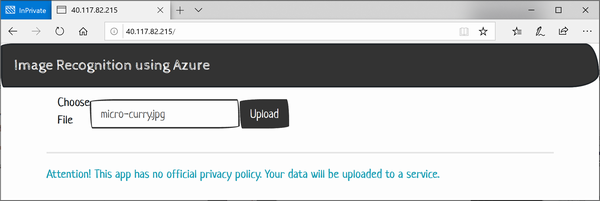

[Upload]ボタンをクリックすると、推論結果が表示されます。

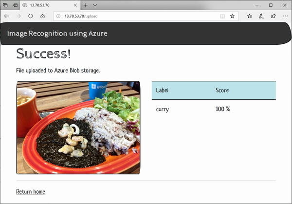


# 9. ローリングアップデート
次に、画像認識アプリをv1.0からv2.0にアップデートします。

Deploymentのマニフェストファイルを開き、イメージのバージョンを修正します。

```config/backend-deployment.yaml
apiVersion: apps/v1
kind: Deployment
metadata:
  name: food-deploy
～注略～
spec:
      containers:
      # コンテナイメージの場所
      - image: acrregistryxxxx.azurecr.io/food-recognition:v2.0 # <=ここを書き換える 
        name: food-container
```

次のコマンドを実行し、Deploymentのマニフェストを更新します。
```bash
$ kubectl apply -f config/backend-deployment.yaml
```

ふたたびブラウザからアクセスすると、ランチメニューではなく、デザートメニューを推論するアプリケーションにアップデートされているのが分かります。

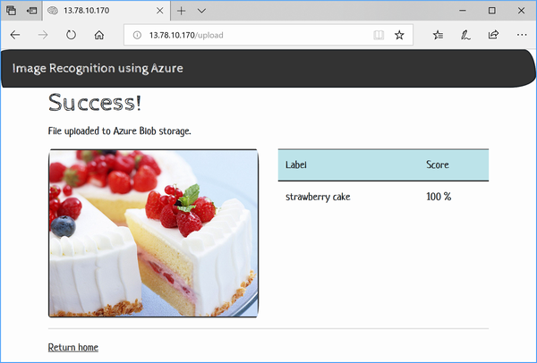


ログを確認すると、バージョンが順次入れ替わっているのがわかります。
```bash
$ kubectl describe pod 
Name:                   food-deploy
Namespace:              default
CreationTimestamp:      Tue, 06 Nov 2018 12:58:56 +0900
Labels:                 app=food
Annotations:            deployment.kubernetes.io/revision: 2
                        kubectl.kubernetes.io/last-applied-configuration:
                          {"apiVersion":"apps/v1","kind":"Deployment","metadata":{"annotations":{},"name":"food-deploy","namespace":"default"},"spec":{"replicas":2,...
Selector:               app=food
Replicas:               2 desired | 2 updated | 2 total | 2 available | 0 unavailable
StrategyType:           RollingUpdate
MinReadySeconds:        0
RollingUpdateStrategy:  25% max unavailable, 25% max surge

~中略~

Conditions:
  Type           Status  Reason
  ----           ------  ------
  Available      True    MinimumReplicasAvailable
  Progressing    True    NewReplicaSetAvailable
OldReplicaSets:  <none>
NewReplicaSet:   food-deploy-f9df7cc47 (2/2 replicas created)
Events:
  Type    Reason             Age   From                   Message
  ----    ------             ----  ----                   -------
  Normal  ScalingReplicaSet  13m   deployment-controller  Scaled up replica set food-deploy-5ff5cc749d to 2
  Normal  ScalingReplicaSet  117s  deployment-controller  Scaled up replica set food-deploy-f9df7cc47 to 1
  Normal  ScalingReplicaSet  114s  deployment-controller  Scaled down replica set food-deploy-5ff5cc749d to 1
  Normal  ScalingReplicaSet  114s  deployment-controller  Scaled up replica set food-deploy-f9df7cc47 to 2
  Normal  ScalingReplicaSet  111s  deployment-controller  Scaled down replica set food-deploy-5ff5cc749d to 0
```


# 10．Podのスケール
次に、Podをスケールします。Webフロントアプリのレプリカ数を3から6に変更します。

```config/front-deployment.yaml
apiVersion: apps/v1
kind: Deployment
metadata:
  name: front-deploy

# Deploymentのスペック
Spec:
  # レプリカ数
  replicas: 6 #<=ここを6に変更する
```
次のコマンドを実行して、マニフェストファイルを更新します。

```bash
$ kubectl apply -f config/front-deployment.yaml
```

ふたたびPodを確認すると、新たに3つのPodが増えて合計6つのPodが起動しているのがわかります。

この例では、「front-deploy-56454d478-ddhk4」「front-deploy-56454d478-dnl2c」「front-deploy-56454d478-rp7s6」の3つのPodが生成されています。

```bash
$ kubectl get pod
NAME                           READY   STATUS    RESTARTS   AGE
front-deploy-56454d478-cv6kv   1/1     Running   0          17m
front-deploy-56454d478-ddhk4   1/1     Running   0          14s
front-deploy-56454d478-dnl2c   1/1     Running   0          14s
front-deploy-56454d478-kf9fj   1/1     Running   0          17m
front-deploy-56454d478-r52qd   1/1     Running   0          14s
front-deploy-56454d478-rp7s6   1/1     Running   0          17m
```


# 早く終わった方は
Webフロントアプリ(front-deploy-xxx)をスケールすると、6つのPodが立ち上がりました。

この状態でバックエンドの画像認識アプリ(food-deploy-xxx)を、現状の2から15にスケールアップしてください。

なにがが起こるか？なぜそうなるのか？内部でどのような動作をするのか？を考えてみましょう。

>#### [ヒント]
> * Resource RequestとResource Limit https://kubernetes.io/docs/concepts/configuration/manage-compute-resources-container/
> * Quality of Service https://kubernetes.io/docs/tasks/configure-pod-container/quality-service-pod/


# クリーンアップ 
今回のハンズオンで使用したリソースグループ（Kubernetesクラスタ・コンテナレジストリ・ストレージ）をまとめて削除します。リソースグループが削除できると、課金は停止します。

```bash
$ az group delete -n $RES_GROUP
Are you sure you want to perform this operation? (y/n): y
```

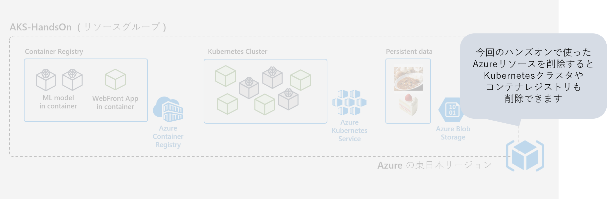

おつかれさまでした 🍺

Enjoy ♥ Kubernetes & Microsoft Azure
